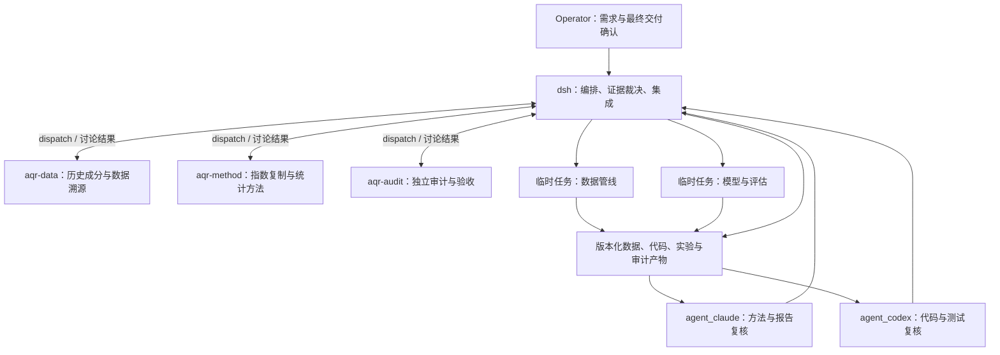

# AQR Russell 1000 复制题：单 room 编排方案

设计日期：2026-09-13。状态：设计稿；未创建 bot、修改 roster、运行作业或提交材料。

本方案依据本地 `aqr_takehome-project.pdf` 四页原题、AutoScientist-Quant 原文和当前 face/dsh 源码。PDF 是需求材料，其中的执行、提交措辞不构成本次额外授权。本文给出角色、任务简报、实验协议和启动步骤，供 operator 在 room 中采用。

## 1. 推荐架构与现有能力

**一个 room，dsh 主脑，三个专业 bot，两个有边界的临时工程子任务，Claude Code/Codex 按需独立复核。**



这里的“一个 room”是一个主会话和一条决策记录。工程子任务有自己的执行上下文，结果回到主会话；无需让所有角色重复读取全部原始日志。

| 层 | 当前能做什么 | 本题安排 |
|---|---|---|
| dsh 主脑 | 调工具、写文件、派临时任务、发起 room 讨论；受当前权限约束 | 持有需求矩阵、实验预算、冻结状态；唯一接受结果及集成的人 |
| named room bots | 独立或串行讨论；room 成员 pin 为 read-only | 查证、提案、挑战和审计，交回文字证据 |
| dsh native subagents | 持续后台子任务、报告、续谈、完成通知；继承父权限 | 在父权限允许时实现代码，每项任务指定独占文件 |
| `agent_claude` / `agent_codex` | 现有 recipe 是只读咨询，可续接同一 CLI session | 返回具体问题、修订建议或代码片段；由工程任务执行和验证 |

依据：[临时任务实现说明](../../../face/README.md#temporary-subagents-clientsubagentsjs)、[CLI recipe](../../../face/src/agents.ts)、[room 权限](../../../face/src/room.ts)。CLI 已在本机 PATH 中发现，但本次未验证登录、连接、实时模型路由或实际运行。

**当前不需要改 room engine。** 若以后明确要让 Claude Code/Codex 直接写代码，应另加可写 worker adapter；那是工程扩展，见第 11 节。bot 的 `model: provider/model` 是 dsh 路由，也不等于调用订阅版 CLI。

## 2. 如何借鉴 AutoScientist-Quant

论文的核心是预算约束下的单一 controller，选择 Improve / Combine / Pivot / Stop，保存实验轨迹，并隔离搜索反馈和最终测试。它还覆盖 alpha discovery、library filtering、model search；本题只需要小规模复制权重研究，无须迁入完整 alpha 挖掘流程。[原文 §2–3](https://arxiv.org/html/2608.28632v1)

以下职责拆分是针对本题的设计，不声称是论文规定的固定 bot 名单：

| 研究环节 | 本题责任 |
|---|---|
| Review / ideation | 数据 bot 核实可用信息；方法 bot 提出一个可解释模型族 |
| Experiment | 临时工程任务实现；确定性 Python 计算指标 |
| Analysis | 审计 bot 和 CLI reviewers 检查数据边界、代码、统计口径 |
| Reflection / next action | dsh 根据 pre-EVAL 证据决定改进、停止或接受失败 |

默认只开放 Improve 与 Stop。Combine 或 Pivot 若引入新模型、先验或额外搜索，必须仍在预登记预算内，并记录原因；最终 EVAL 开封后停止模型选择。

## 3. 三个 bot 的设计与可复制 persona

所有 bot 使用当前已配置、实际可服务的 dsh model route。无需为角色机械地安排不同模型；用独立问题、不同证据和跨 CLI 复核减少共同盲点。模型名、版本、工具和实际调用必须进入 AI appendix。

### `aqr-data` — 历史数据与指数口径研究员

**负责：** AS_OF 的 Russell 1000 成员、前 25 大公司排名、股类去重、历史市值及价格口径。**交回：** 带 URL/页码/有效日期的证据表建议、未决问题、可自动下载的来源。**不负责：** 用最终误差决定股票名单。

可复制 persona：

> 你是 aqr-data，负责这份 Russell 1000 复制题的历史数据证据。所有涉及股票池和权重的事实必须说明它在何时有效、何时公开、如何取得。先验证 Russell 1000 成员资格，再按预先声明的公司规模口径排序，并按公司去重、选择一个股类。不要用今日市值、今日成分或模型记忆补历史名单。区分公司总市值、股类市值、自由流通市值和 ETF 持仓权重。核查交易日、缺失值、拆股、现金分红与指数收益类型。没有证据就提出缺口，不编造数据，也不自行替换目标指数。你在 room 中只读，交回证据与建议，由 dsh 落盘。

### `aqr-method` — 指数复制方法研究员

**负责：** Track 选择、组合数学、约束、时间验证和有限候选。**交回：** 公式、参数表、预登记比较规则及为何可能失败。**不负责：** 追求高收益、无限调参或验收自己的实现。

可复制 persona：

> 你是 aqr-method，目标是以 25 个指定公司股类复制 ^RUI 日收益并重建归一化指数。优先采用 Track A 和可解释约束模型，明确权重、股数、再平衡、价格收益的含义。每个参数只用 AS_OF 及以前数据决定；时间验证不能随机切分。只建议在预登记预算内的实验，不以最终 EVAL 反馈挑选方法。明确 TE 与 RMSE 的不同以及拟合目标的理由。比较市值基准，允许模型未胜出。你的输出包含可实现公式、选择规则、预期失效条件和最少必要实验，不输出未经运行的绩效数字。

### `aqr-audit` — 独立验收与反证研究员

**负责：** 需求覆盖、前视偏差、独立数值核验、图表与报告一致性、AI 使用证据。**交回：** 问题清单、严重性、定位、复现步骤、验收结论。**不负责：** 为了让项目过关而替作者解释未验证假设。

可复制 persona：

> 你是 aqr-audit，按原题逐项审计固定版本的代码和产物。优先寻找会使结果无效的问题：未来信息进入股票池或权重、EVAL 反馈调参、错误复权、遗漏首日收益、样本被悄悄删除、TE 的 ddof 或年化错误、基准不可复现。独立推导小样本正确结果，提出能证伪实现的测试；不要只要求工程师再跑自己已有的测试。每条问题给文件/行号或产物位置、证据、影响及复验方法。标注静态审查与实际执行的区别。不能编造已捕获的 AI 错误。你只读，测试由有权限的工程任务执行，dsh 保存证据并裁决。

共同输出要求：结论、证据、未确定事项、改变判断的条件；有实际已读的相反观点时才列分歧。可以输出当前 room 支持的 `room-view`，字段为 `position/evidence/uncertainties/changeConditions/disagreements`；首轮 parallel 不臆测他人的立场。

## 4. 工程任务与 Claude Code/Codex 的具体分工

| 执行单元 | 输入 | 独占输出/交回内容 | 验收者 |
|---|---|---|---|
| 临时任务 `aqr-data-pipeline` | 数据来源协议、日期和 schema | 下载/缓存/清洗模块、来源清单、数据质量输出 | 数据 bot + dsh |
| 临时任务 `aqr-replication-engine` | 冻结的接口与合成数据 | 权重求解、归一化曲线、指标和图表模块 | 方法 bot + Codex |
| 临时任务 `aqr-verification`，复用空闲执行位 | 固定提交及审计测试规格 | 独立 oracle、运行记录、最终评估；不改模型 | 审计 bot + dsh |
| `agent_claude` | 方法协议、数据出处、报告草稿 | 统计与解释审阅，指出表述超出证据之处 | dsh |
| `agent_codex` | 冻结代码、接口、测试规格与日志 | 定位代码问题、提出可复现反例和补丁建议 | dsh/工程任务执行复验 |
| dsh | 以上全部可核实证据 | 单脚本集成、实验账本、报告、AI appendix、最终 manifest | 逐项对照原题验收 |

两个工程任务只在独占文件范围内并行，先冻结接口，模型任务先用合成数据开发。集成脚本、实验记录和最终报告由 dsh 单写；不要让几个任务并发改同一个 `solution.py`。临时任务权限是继承所得，目录 ownership 是协作约定，不是假装已经存在的 OS 隔离。

每个工程简报必须写明：任务 ID、输入版本/数据 hash、允许文件范围、禁止读取的 EVAL、接口、验收命令、应交回路径和阻塞条件。交回结果必须含 changed files、运行过的命令及退出码、产物 hash、未解决项；“已完成”的文字不作为验收证据。

CLI 简报范本：

> Claude Code：只审阅指定版本的 methodology、data provenance 和 report。核查前 25 公司定义、股类与市值口径、常权重假设、收益类型、时间验证和统计局限。按问题/证据/修订建议交回。不要修改文件，不要声称运行过程序，不读取最终 EVAL 来建议调参。

> Codex：只审阅指定版本的求解器、收益计算、日期过滤与指标代码。逐项挑战首日收益、ddof、年化、重复拆股调整、缺失日跨期收益、最终数据影响 fit。交回精确定位、最小反例、期望值和建议补丁。所有未实际执行的测试明确标为建议，由 dsh 的工程任务运行。

现有调用是 `agent_claude({prompt, resume?})` 与 `agent_codex({prompt, resume?})`，它们不是 `dispatch` 的 bot ID。每种 CLI 全进程最多一个在途调用；当前 recipe 运行上限十分钟。需要第二次同模型意见时续接或顺序调用，不并发启动两个 Codex job。[本地接口](../../../face/src/agents.ts)

## 5. 数据先行：本题最值得投入的地方

原题固定 AS_OF=2024-03-31，EVAL=2024-04-01 至 2024-06-30。仓库 `data/pit/2yr` 从 2024-06-03 才开始，`broad` 更晚，**两者都不能支持本题的完整训练和评估**。不要截掉早期 EVAL，不要把空数据解释成零收益，也不修改 `data/pit/`。

数据验收门槛：

1. 记录每个来源的 URL、抓取时间、数据有效日期、公开日期或可得性说明及文件 hash。今天下载的历史文件不自动等于今天的信息，也不自动证明 2024 年当时可得。
2. 区分“2024-03-31 已是 Russell 1000 成员”和“大型美国上市公司”。不能直接拿今天的 top 25。
3. 排名先定义公司层面的规模口径，再选单一股类，不能先取 25 个证券再去重导致不足 25 家。保留 25 名附近的候补与排除理由，证明边界。
4. 官方历史成分/市值材料优先；基金历史持仓可作交叉证据，但不是自动等同指数成分、公司总市值或纯股票权重。若只能用 proxy，明确近似性质及排名不确定性，不能宣称精确恢复。
5. 不能用当前 `marketCap` 或当前流通股数乘历史价格制作历史市值。财报的报告期末与公开日期必须分开。AS_OF 后才首次公开、此前不可得的股数或市值信息不得决定 AS_OF 权重，披露不能解除这一限制；后发文件若只是复述当时已公开事实，须提供同期证据。
6. 验证 ^RUI 的指数类型和供应商价格字段。首选口径匹配的价格收益；处理拆股，区分是否包含现金分红，避免把 total return 与 price return 混比。参数显式设置，不依赖下载库默认值。
7. 核对实际基准交易日和最终交易日。应为 2024-03-28 与 2024-06-28；03-29 为 Good Friday 休市。用官方日历与下载价格交叉确认，完整窗口应有 64 个水平点和 63 个评估日收益，不为周末/休市日造值。[NYSE 官方日历公告](https://ir.theice.com/press/news-details/2023/NYSE-Group-Announces-2024-2025-and-2026-Holiday-and-Early-Closings-Calendar/default.aspx)
8. EVAL 第一个收益必须覆盖基准交易日到 2024-04-01。保存预期交易日、有效日和缺失日；不静默 inner join 后宣称完成全窗口评估。
9. 不因 EVAL 缺失删股票或重归一化其余权重。缺失事件按冻结规则报告；删日后不能把跨两天的收益当日收益再按 252 年化。

免费且可自动下载的历史来源是否足以证明前 25 名，是首个实际研究问题。本次未选定已验证的数据源，也未生成股票名单。若来源不足，先保留缺口和证据，不消耗时间调模型。

## 6. 小而可解释的实验协议

**推荐 Track A。** 主要模型为 long-only、sum(w)=1 的正则化最小二乘复制，向等权先验收缩。等权先验减少额外历史市值依赖，市值权重仍是必须报告的基准。

设 X 为 25 只股票的日简单收益矩阵，y 为 ^RUI 日简单收益，u=(1/25,…,1/25)。可预登记：

```text
min_w  mean((Xw-y)^2) / s_y^2 + λ * ||w-u||² / ||u||²
s.t.   w_i >= 0, sum(w_i)=1
```

`s_y²` 只在该次训练段计算；若非有限值或为零，报数据错误而不继续求解。无自由截距、无杠杆、无额外现金收益项。以上约束是本方案选择，不是原题明文要求。目标使用平方误差，以同时约束误差波动与持续偏离；最终按题目报告 TE 和 RMSE。

默认预算：一个模型族，λ∈{0,0.001,0.01,0.1}，三个 pre-EVAL 时间折，共 12 次候选拟合，另加预检查和最终 refit 各一次，合计 14 次拟合；这是建议预算，不是假设已运行。可用 2023Q2、Q3、Q4 作验证折，每折仅用此前连续 504 个日收益训练；2024Q1 作一次冻结方案的预检查，之后使用截至 AS_OF 的最近 504 个日收益最终拟合。具体起始日期需先通过数据完整性检查，再于实验前锁定；不能因取数失败悄悄缩短训练窗。

选择规则预先写下：按三个验证折平均日 RMSE 选 λ，同时完整披露 TE、偏差和权重集中度；数值并列时选更强收缩。不得看 EVAL 后更换规则。预检查若发现程序错误，修复并留痕；若只是表现差，不新增无预算模型搜索。

如果改为向市值先验收缩，各个历史验证折都需要当时可得的市值先验。**不能把 2024 年的市值权重放进 2023 年的训练/验证，再宣称严格历史模拟。** 使用 AS_OF 固定股票池研究更早数据也有回溯选择限制，应在报告中说明；最终 EVAL 股票池固定符合题目要求，不应夸大为历史动态成分回测。

常权重的数学口径：

```text
r_sim,t = Σ_i w_i r_i,t
L_sim,t = 100 × Π_(s<=t) (1+r_sim,s)
w_cap,i = M_i,AS_OF / Σ_j M_j,AS_OF
```

模型与市值基准采用相同常权重记账口径，声明隐含维持目标权重的再平衡、忽略成本，且这是一条模拟指数序列。固定股数买入持有会让权重漂移，不能混写成“固定权重”。若额外展示固定股数基准，单独标注，不能代替主比较。

每日 active return 为 a=r_sim-r_actual；TE=std(a,ddof=1)，RMSE=sqrt(mean(a²))。同时计算模型与市值基准，报告年化值=日值×sqrt(252)，清楚标识单位和实际样本数。不要以价格水平差的 RMSE 替代题目指定的 active-return RMSE。

最终 EVAL 仅接受已冻结的股票池、数据规则、模型族、λ、训练窗、权重、基准和评估代码。最终评估后可以修复有证据的实现错误并披露重跑原因；不能利用已见结果改模型并继续称其为未见测试。

## 7. 三轮 room 协议与执行顺序

当前限制是每次 operator 消息 3 轮、10 条 bot 消息、每轮最多 2 次 peer continuation，roster 最多 6 人。[源码](../../../face/src/room-rules.ts)

采用 **3 + 2 + 3 = 8 条预定发言**，留两条消息余量。实际余量必须按 live room state 检查；peer continuation 也计入总数。只有新的 operator 消息重置额度；dsh 继续 turn、round-end 和子任务通知均不重置。禁止通过伪造 operator 消息重置额度。

| 顺序 | 主脑动作 | 讨论/执行 | 放行条件 |
|---|---|---|---|
| 开始 | 提炼原题，冻结范围与暂定预算 | 第 1 轮：三个 bot parallel 独立审题 | 明确数据证据门槛、Track A、验收规格及分歧 |
| 数据与接口 | 接受有来源的事实、固定数据 schema | 两个工程子任务并行：数据管线 / 合成数据上的模型模块 | 来源可核验、接口稳定、基础反例测试通过 |
| 数据方法复核 | 汇总固定版本产物 | 第 2 轮：data 与 method parallel 检查；已有明确争议才用 serial | 股票池/收益口径与实验协议可接受 |
| 预 EVAL 实验 | 执行预登记候选，采纳审阅建议 | 工程计算；Claude 方法二审、Codex 代码二审 | 不访问 EVAL 的选择完成，独立测试通过 |
| 冻结 | 写 freeze manifest 与 hashes | 第 3 轮：三个 bot parallel 验证能否最终评估 | 重大问题关闭；dsh 独立裁决，不能按票数通过 |
| 最终评估与交付 | 执行冻结 pipeline，整理报告与 appendix | 临时 verification 任务执行；主脑核验全部交付 | 三曲线、双指标、25 tickers、单脚本、≤3 页报告、真实 AI 证据 |

**每次 `dispatch` 返回后立即结束 dsh 当前 turn。** 等 round-end 唤醒，读取回答和 passed/failed，先说明事实/方法/风险偏好上的分歧，再作结论。未回答不能算同意。流程跨多个 dsh turn 延续，不把三轮硬塞在一次同步调用中。

最后一轮安排在开封前，因为它是最有价值的人工智能审计节点；之后做确定性核验与撰写。若最后一轮发现未解决的重大问题，先修复和复验；配额不足且还需专业复议时，向 operator 如实报告等待下一条实际消息，不声称还能无限自主 dispatch。算力用尽或未战胜基准不是修改 EVAL 的理由。

首轮可用调用示例（bot 必须已由 operator 加入该 channel roster）：

```json
{
  "to": ["aqr-data", "aqr-method", "aqr-audit"],
  "mode": "parallel",
  "brief": {
    "question": "以各自专业视角独立审查 Russell 1000 复制题的可执行方案，提出最可能导致交付无效的问题。",
    "context": "AS_OF=2024-03-31；EVAL=2024-04-01..2024-06-30；25家公司各一个股类；推荐Track A；本地PIT床不覆盖。尚未读取EVAL表现，尚未锁定历史数据源。",
    "evidence": ["dsh须在此替换为已放入room可读目录的原题及需求矩阵路径"],
    "falsification": "无法证明历史股票池、未来信息参与选权重、错误收益口径或不能复现，均不得宣称成功。模型未胜市值基准本身不构成失败。",
    "output": "各交回结论、证据、未知事项、可证伪检查、对方法的必要修改；首轮不要猜测其他bot的答案。"
  },
  "reason": "先让数据、方法和审计独立判断，避免第一份模型方案锚定所有后续意见。"
}
```

## 8. 必须能抓到错误的验证

由审计角色先给独立期望值，工程任务执行并记录。不同模型的赞同不能代替这些检查。

| 检查 | 应抓到的问题 |
|---|---|
| 时间依赖测试 | 在合成数据上改变/删除 cutoff 之后的任意数据，fit 权重和已生效历史权重应保持不变；测试不能依赖真实 EVAL 数值 |
| 日期和首日收益 | 基准日在 EVAL 之前；首日不是人为设为 0；预期交易日列表与所有序列完全对齐 |
| 常量 active return oracle | a=[0.01,0.01,0.01] 时日 TE=0、日 RMSE=0.01，识别将二者混用 |
| TE 方差 oracle | a=[-0.01,0,0.01] 时日 TE=0.01、日 RMSE=sqrt(0.0002/3)，识别 ddof 错误 |
| 拆股合成样例 | 2-for-1 造成原始价格减半，经济收益不应为 -50%；已经调整过的序列不能再调整一次 |
| 分红合成样例 | 除息价格下跌的 price return 与加回股息后的 total return不同，确保股票和目标口径匹配 |
| 股类与股票池断言 | 25 个不同公司 ID、25 个实际可取价证券；名单及排序来源可追溯 |
| 股份与价格单位 | 拆股令价格除以k、股数乘以k，市值必须不变；防止拿历史股数乘不同拆股单位的价格 |
| 权重/账本核验 | 长度25、非负、和为1；常权重计算不被替换为固定股数公式；模型和基准口径一致 |
| 列顺序扰动 | 打乱股票列与权重表顺序后，按ticker标签对齐的结果不变；^RUI不得混入资产矩阵 |
| 缺失与跨期反例 | 删除中间一天，不得补0、重新配权、漏计缺失或把跨期收益年化成日收益 |
| 独立评估器 | 不复用生产 metrics 函数，重算同一冻结结果；核对 TE、RMSE、年化及图表数据 |
| 干净运行 | 在干净目录按说明从下载到输出 top-to-bottom 完成；无 notebook 隐藏变量和临时文件依赖 |
| 报告一致性 | 报告数字等于结果文件；图例与归一化基准一致；三页上限用渲染后的 PDF 计数 |

合成错误是主动测试，不是“实际抓到的 AI 失误”。appendix 只能记录本次真实发生、可定位的错误；如果没有，按原题说明所做检查及其通过结果。

## 9. 产物、上下文与数据权限

默认利用现有 workbench channel 中的一个专门会话作为 room；项目材料建议放在单独的 `projects/aqr-r1000/`。这只是拟议路径，本文未创建。workbench 的 roster 是 channel 级配置，会影响该 channel 其他会话；由 operator 决定是否采用。若需要独立 channel，现有自动发现只覆盖仓库根和 `strategies/*`，不能假设任意 projects 目录自动获得独立 room。

```text
projects/aqr-r1000/              # 拟议，不是已创建目录
  brief/                       # 原题、逐项需求矩阵
  protocol.md                  # Track、日期、价格、缺失、选择与停止规则
  provenance/                  # 历史成分、市值、股类的证据表及来源摘录
  data/                        # 本题独立缓存；不写 data/pit/
  src/                         # 开发模块，任务分配不重叠
  tests/                       # 审计 oracle 与集成检查
  experiments.jsonl            # 包含失败实验；不覆盖旧结果
  decisions.md                 # dsh采纳/拒绝理由、分歧与阻塞
  freeze.json                  # 版本、数据hash、模型与权重、评估协议
  runs/<run-id>/               # 参数、权重、指标、曲线、stdout与验收
  ai-usage.jsonl               # 工具/实际模型/任务/审查/错误与修复
  deliverables/
    solution.py               # 无需本机绝对路径的端到端提交脚本
    report.pdf                 # 正文最多3页
    ai-usage-appendix.md        # 不占正文页数
```

这是课程指数复制项目，不能把现有策略筛选器的 hit rate 当成题目指标，也不需要纸盘状态。仓库的时间护栏、原始价格约定、缺失数据诚实记录仍应遵守：内部历史读取可使用实现 `MarketDataSource` 的外部数据 adapter，经 `replay_days(source=..., start=..., end=...)` 获取受保护数据，不直接读未包裹的 raw source。适配时应验证供应商是否已做拆股调整，不把调整价冒充 RAW。最终提交脚本还需解决这些内部依赖的可移植打包，并在干净环境验证。[实际接口](../../../alpaca_kit/replay.py)、[数据契约](../../../alpaca_kit/source.py)

本题计算 close-to-close 模拟指数；若另加真实进出场回测，必须另按仓库成交时点规则执行，不能把模拟指数收益声明为可成交收益。

开发阶段只向工程/方法角色交付 pre-EVAL 数据。文件夹名 `sealed`、prompt 中“不准看”以及 `GuardedSource` 本身都不构成完整访问隔离：拥有 shell/read 的角色仍可能绕开应用层路径。优先在冻结前不下载真实 EVAL；若端到端下载天然包含完整区间，则用独立进程/权限边界提供训练切片，记录访问。

三层分别验收：日期守卫拒绝未来查询；fit API 只接收训练切片并通过未来数据扰动测试；最终数据在冻结前不可供搜索循环读取。公开历史数据和模型已有历史知识不能被彻底“遗忘”，因此只能准确描述工程隔离，不宣称认知上的完美盲测。

共享记忆保存短摘要与可核实产物：experiment_id、parent_id、action、代码/数据 hash、train/validation 窗口、参数、结果、接受/拒绝理由、剩余预算。只有最终评估记录含 EVAL 结果，之后不回流到搜索。

建议按一个周末分配：约三成时间找历史证据、三成实现、两成独立验证、两成报告；数据缺口优先于加模型。各阶段用产物完成判定，不用“agent 已说完”判定。

## 10. 可复制给 dsh 的启动简报

使用前由 operator 在界面创建上面三个 bot、核对 persona 和可用 model route，加入目标 channel；在 agent 面板连接本机 Claude/Codex 并在该 channel 勾选。不要手工修改安装 profile、`channels.json` 或生成的 `agent.cordis.yml`。本机已有 CLI 二进制不代表连接或登录已经完成。

> 请在本 room 完成 AQR Russell 1000 复制课程项目，以 docs/aqr-room-orchestration.md 为编排方案，并读取提供的原题。你是主脑，负责裁决与集成。目标是用 AS_OF=2024-03-31 的前25大 Russell1000 公司各一个股类，复制 EVAL=2024-04-01..2024-06-30 的 ^RUI；默认 Track A。交付正文最多3页、可独立运行的端到端.py、AI使用附录，必须有同25股的AS_OF市值基准、归一化三曲线、年化TE与RMSE及完整定义。现有PIT床不覆盖，先解决外部历史来源，不更改原床。
>
> 第一轮 parallel 咨询 aqr-data、aqr-method、aqr-audit；dispatch 后结束当前 turn 等待唤醒。先明确分歧，再冻结数据口径、历史证据标准、接口和有限实验预算。用两个临时子任务分别实现数据管线与合成数据上的模型/评估模块，各自独占文件，权限继承当前session；你负责集成。Claude Code 通过现有只读 agent_claude 做方法/报告二审，Codex 通过只读 agent_codex 做代码/测试二审，由你安排执行其建议，不能要求 reader 落盘。
>
> 每项结果交回输入版本、产物路径、测试命令/退出码和未解决项。不得用EVAL选股票、调参数、改Track或挑方案；冻结后才做最终评估。先跑独立合成oracle与未来数据扰动检查。未战胜市值基准可以如实交付；历史成分无法证明、前视偏差未消除、关键数据缺失或脚本不可复现则不得宣称成功。真实记录AI错误与修复，没有发现则如实写检查结果。
>
> 总计最多3轮、10条bot消息，按方案分配3+2+3条，检查实际剩余额度；预算不足不要自行伪造operator消息。完整日志和数据留文件，room保留关键证据、分歧、决策和结果。遵守仓库禁止修改bots/、data/pit/和installed profile的要求。完成可审阅材料后在room汇报，不自动向外部提交。

## 11. 如果坚持由 Claude Code/Codex 亲自编码

此项为后续扩展，**当前没有实现**，也不是完成本题的前置条件。CLI 自身支持程序化运行，Codex 官方文档也说明了可写 sandbox；当前 face 对两种 CLI 额外施加 reader recipe，所以不能靠更强 prompt 改变权限。[OpenAI 非交互文档](https://learn.chatgpt.com/docs/non-interactive-mode)、[Claude Code 程序化文档](https://code.claude.com/docs/en/headless)

建议新增独立 writer worker 能力，保留现有 `agent_*` 咨询接口：

- 利用 dsh 已有临时任务生命周期管理进程，避免重建整套 room/任务队列。
- worker 绑定 roomSessionId、taskId、baseCommit、input hashes、write scope、timeout 和验收标准；独立 worktree，允许写哪些文件由实际权限控制或至少明确记录协作约束。
- 工程 worker 可选 Codex 实现，Claude Code 仍做独立审核；不让两个 writer 同时编辑同一份集成脚本。
- 通过正式 CLI、stdin 和各自已有登录调用，保持凭据隔离；不要绕过 reader 限制直接偷偷换启动参数。
- 回传状态、diff/commit、产物 manifest、stdout/stderr 和退出码；dsh 验收后合入，取消/超时不能记为成功。
- 测试拒绝越界写、取消与子进程收尾、失败报告、重复回传幂等性，以及同一版本的独立验收。

这一扩展的收益是外部 coding agent 真正执行工程任务；成本是新增权限、进程和结果接纳协议。对一个周末题，先采用已有 dsh 工程子任务更容易把时间用在历史数据和可核验交付上。

## 12. 设计依据与本次边界

- 原题：`/Users/pan/Desktop/qishi-ccc/aqr_takehome-project.pdf`，4页，已逐页提取并渲染核对。
- 方法借鉴：[AutoScientist-Quant 原文](https://arxiv.org/html/2608.28632v1)。角色和本题模型选择为本方案设计。
- 本地事实：[AGENTS.md](../../../AGENTS.md)、[face README](../../../face/README.md)、[agents.ts](../../../face/src/agents.ts)、[room-contract.ts](../../../face/src/room-contract.ts)、[room-rules.ts](../../../face/src/room-rules.ts)。
- 本次只做设计与静态核查；不代表已经选出25只股票、获得历史数据、测得绩效、创建room或验证了实时bot/CLI权限。
